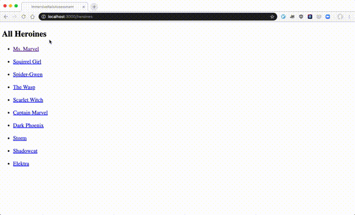

# Rails Code Challenge - Superheroines

For this assessment, you'll be working with a heroines and powers domain.

In this repo, there is a Rails application with some features built out. Your job is to extend this code to add the functionality described in the deliverables below.

## Topics

- MVC
- REST
- Request-Response Cycle
- Forms and Form Helpers
- ActiveRecord
- Validations

## Setup

Before you begin coding your solution, clone this repo and then `cd` into it. Then run `bundle install`, `rails db:migrate`, and `rails db:seed` to install dependencies and set up the database, and run `rails s` to start the server.

## Domain

There are three models in the domain: Power, Heroine, and a join model HeroinePower.

Each Heroine can have multiple powers. Powers can belong to multiple Heroines.

## What You Already Have

The starter code has migrations, models, and seed data for the initial Power and Heroine models. There are also routes, controllers and views to support the Power and Heroine index pages.

Once you have followed the setup instructions above, visiting the `/powers` route will display all of the Powers. Similarly, visiting `/heroines` will list all the heroines.

***Schema***

Heroine

| Column | Type |
| ------------- | ------------- |
| name | String |
| super_name | String |
| created_at  | DateTime  |
| updated_at  | DateTime  |

Power

| Column | Type |
| ------------- | ------------- |
| name  | String  |
| description | String  |
| created_at  | DateTime  |
| updated_at  | DateTime  |

## Instructions

Update the code of the application to meet the following deliverables. Follow RESTful naming conventions and the MVC pattern to divide responsibility.

***Read through these deliverables carefully to understand the requirements for this code challenge. Tackle them one by one, as they build on each other sequentially.***

### 1. Heroine-Power association

Create the association between the models. Update the schema and models to create the HeroinePower association.

A HeroinePower should have a:

- a heroine
- a power

Each Heroine can have multiple powers. Powers can belong to multiple Heroines.

### 2. Heroine index page links

On the heroines index page, a heroine's super name should link to that heroine's show page.

### 3. Heroine show page

Each Heroine show page should include the:

- name (eg. Kamala Khan)
- super name (eg. Ms. Marvel)

### 4. Power show page

Power show page should include the:

- name
- description

### 5. Heroine Create page

Show a form to create a new Heroine. It should have:

- an input for name
- an input for super name
- a select dropdown to choose a power
- a submit button to create the Heroine

After successfully creating a Heroine, the user should be redirected to the new Heroine's show page.

### 6. Heroine Validations

Add validations to the Heroine model:

- must have a name
- must have a super name

Add error handling to the create action. If a user tries to create an invalid Heroine, the user should see the validation errors.

### 7. Advanced: Heroine Super Name Validation

No two heroines should have the same super name.

- Add a validation to prevent this.
- Update the error handling in the create action to display this error

### 8. Advanced: Display Heroines' Powers

Update the Heroine show page to display the Powers that the heroine has.

Each power should link to the corresponding Power show page.

### 9. Advanced: Power Update Form to Link Multiple Heroines

Show a form to update a Power. It should have:

- a text input for the name with the current name already displayed
- a text area input for the description with the current description already displayed
- a list of Heroines, with a checkbox for each one
- a submit button

The update action should create associations for each of the Heroines the user selected.

When the form successfully saves, the user should be redirected to the Power show page.

The power show page should show a link to the edit page.

### 10. Advanced: Powers Index Page Display Heroine Count

On the Powers index page, show the total number of Heroines for each Power.

### Feature Demo

## Rubric

### Models, Associations, and Validations

1. Models, associations, and validation not started or have errors that prevent the application from running. Missing validations, or validation syntax is incorrect. May have introduced models outside the specified domain.
2. Models, associations, and validations attempted but incomplete or have errors. Associations may construct the wrong relationships. Validations may be missing or applied to the wrong models. Advanced query methods incomplete or have errors.
3. Models, associations, and validations mostly complete and correct per the deliverables. Advanced validations and methods may be incomplete. May have unused or unnecessary code, possibly including duplication. May have written validations instead of using appropriate built-in validations. May implement advanced query methods with iterators instead of using built-in methods.
4. All models, associations, and validations are complete and correct, save minor mistakes in advanced deliverables. Advanced validations are complete and add informative error messages.
5. All specified models, associations, and validations complete and correct. Built-in validations are used when appropriate. Variable and method names are intention-revealing. Models have appropriate logic extracted from controllers and views. Advanced query methods use appropriate built-in methods.

### Routes, Controllers, and REST

1. Routes missing, naming does not follow REST, controller actions incomplete or with errors.
2. Some routing and controller logic implemented, but incompletely or incorrectly. May have routes or controller actions not included in the deliverables. May include routes that have no corresponding controller action or vice versa. Controller methods might do work beyond their responsibility in MVC.
3. Most routing and controller logic working as specified. Some advanced deliverables may be incomplete. Routing follows REST convention. Routing table might include some unused routes, or routes and actions that were not specified in the deliverables. Logic may be duplicated between methods.
4. Nearly all routing and controller deliverables completed, possibly with minor errors in advanced deliverables. Routing follows REST conventions. Some logic may be duplicated between controller actions, or not respect MVC separation of concerns. Attempts to use filters and private helper methods to reduce duplication, but some duplication may remain.
5. All routes and controllers deliverables work as described in the instructions. Routing follows REST naming conventions. Controller actions respect MVC separation of concerns, and don't have logic that belongs in the model or the view. ActionController filters and private helper methods are used appropriately to reduce duplication in controller actions.

### Views and Forms

1. Missing or unattempted views and forms, or erb syntax errors in views and forms. Forms created in the wrong views, do not accept the correct input, or do not submit to the correct location. Data not displayed correctly.
2. Views display some data correctly. Forms attempted, but with some errors that prevent submitting data correctly. May not have attempted or may have significant errors in advanced deliverables.
3. Uses view to show data as specified. At least one working form that submits data to the correct location. May not have attempted some advanced view features. May have included views not specified by the deliverables. May include model or controller logic in the view. Forms may accept invalid input (for example, out of range numbers). May not display validation errors correctly. May not use view helper methods to reduce duplication.
4. Nearly all view and form deliverables are complete and correct. May have minor logic errors in advanced deliverables. Mostly does not include controller or model logic in the views. Mostly uses helpers to reduce duplication.
5. All view and form deliverables are complete and correct, including advanced form components. No views not specified by the instructions. No model or controller logic present in the views. Appropriate use of helpers and built-ins to reduce duplication. Validation errors displayed correctly on form.
